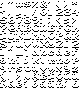
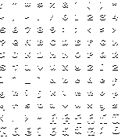
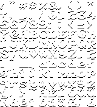
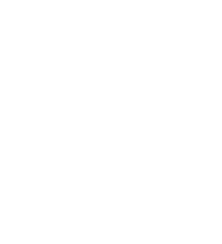

# Fonts for Butano

Font assets for Game Boy Advance development using the Butano engine

## Table of Contents

- [Integration](#integration-with-butano-projects)
- [Preview](#preview)
  - [Arthur](#arthur)
    - [8x8](#8x8)
    - [8x12](#8x12)
    - [16x16](#16x16)
    - [16x24](#16x24)

## Integration with Butano Projects

To use these fonts in your Butano project, follow these steps:

### 1. Clone or Add as Submodule

Clone this repository or add it as a git submodule to your project:

```bash
# Option A: Clone to a subdirectory
git clone <repository-url> butano-fonts

# Option B: Add as submodule
git submodule add <repository-url> butano-fonts
```

### 2. Update Your Makefile

Add the following lines to your Butano project's `Makefile`:

```makefile
# Butano Fonts
FONTDIR = butano-fonts
ifndef FONTDIRABS
	export FONTDIRABS := $(realpath $(FONTDIR))
endif
include $(FONTDIRABS)/font_arthur.mak
```

### 3. Example Integration

Here's how it looks in a complete Butano Makefile:

```makefile
TARGET      := your-game
BUILD       := build
LIBBUTANO   := engine/butano
SOURCES     := src
INCLUDES    := include
GRAPHICS    := graphics
# ... other standard Butano variables ...

# Butano Fonts
FONTDIR = butano-fonts
ifndef FONTDIRABS
	export FONTDIRABS := $(realpath $(FONTDIR))
endif
include $(FONTDIRABS)/font_arthur.mak

# Include main butano makefile
include $(LIBBUTANOABS)/butano.mak
```

The `fonts_arthur.mak` file will automatically add the necessary `INCLUDES` and `GRAPHICS` paths to your build process
when `FONTDIR` is properly set.

## Preview

### Arthur

#### 8x8



#### 8x12



#### 16x16



#### 16x24

